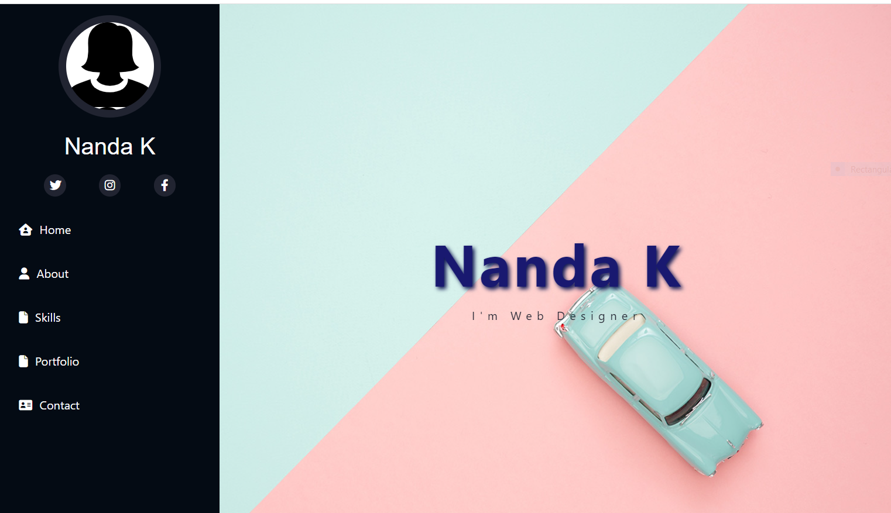
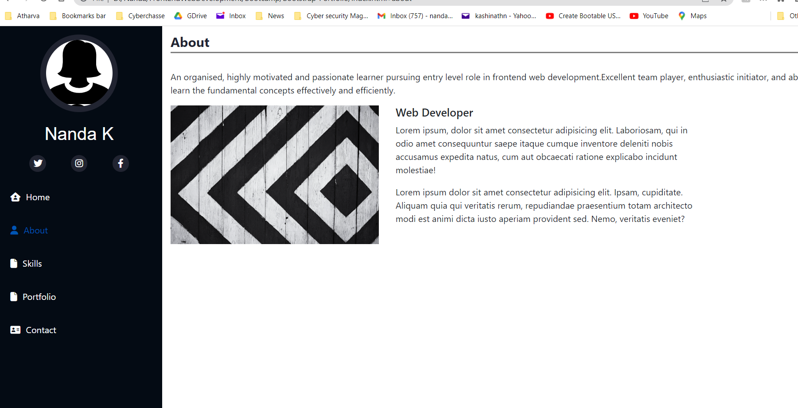
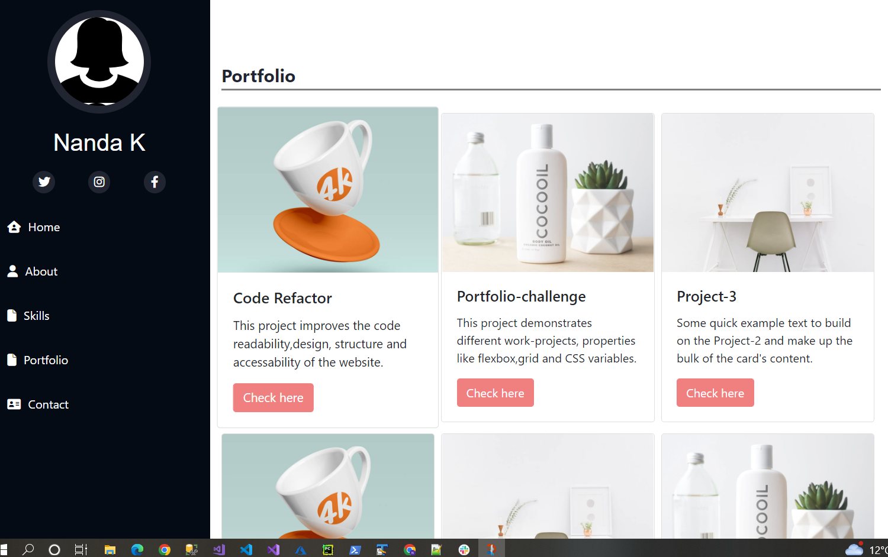
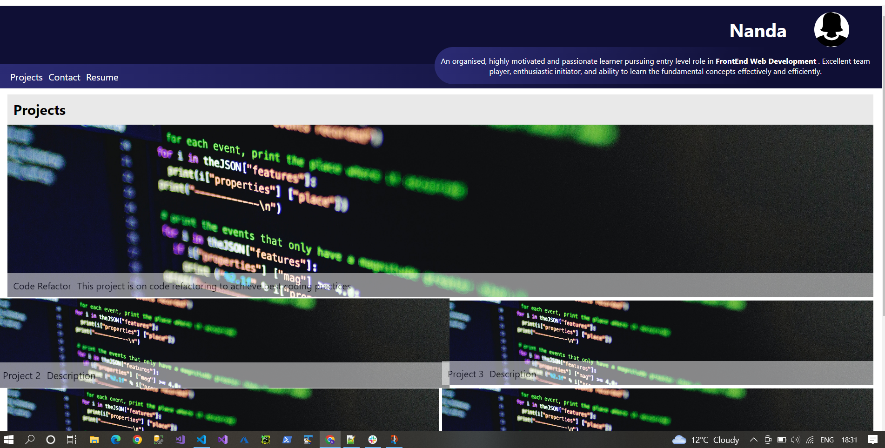
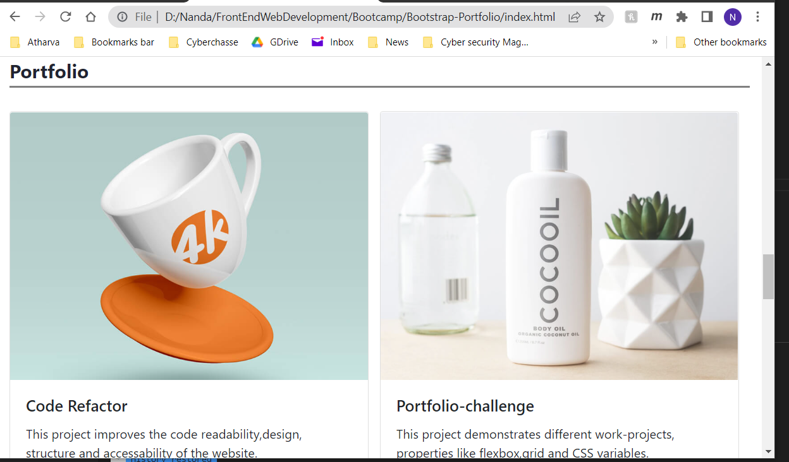
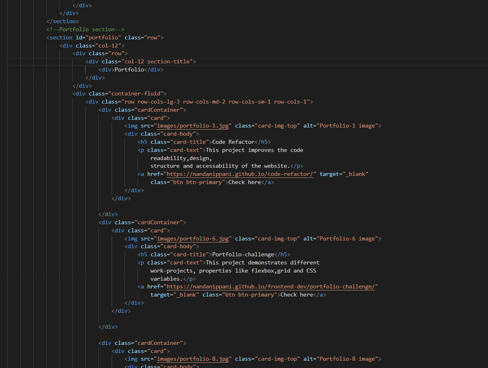

# Bootstrap-Portfolio
## Description
Following points shows that the portfolio that I developed satisfies typical hiring managers's needs.

* When portfolio website is loaded,page shows my name, avatar, links to my projects and my contact details.

* When one of the links in navigation bar clicked UI scrolls to the corresonding section.
Here I clicked on projetcts links it scrolls to Projects section

* When viewing section of my work,it shows titled image of my application.
Here I have uploaded my previous challenges as  my projects.
Here you can see my second project portfolio-challenge.

* When image of my second project portfolio-challenge clicked, it takes to the deployed application.

* When page is resized or viewed on various screens and devices then layout is responsive and adapts to my viewport.

## Following images shows usage of bootstrap in my project

### The URL of the deployed application

https://nandanippani.github.io/Bootstrap-Portfolio/

### The URL of the GitHub repository that contains my code

https://github.com/Nandanippani/Bootstrap-Portfolio

## Installation

N/A

## Usage

This is my bootstrap portfolio project which shows my different projects and also demonstrates ability to use bootstrap.

## Credits

N/A

## License

Please refer to the LICENSE in the repo.

